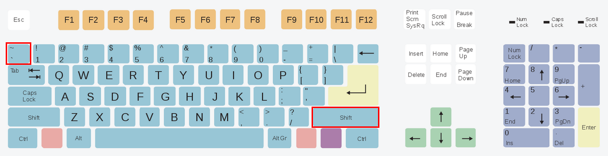
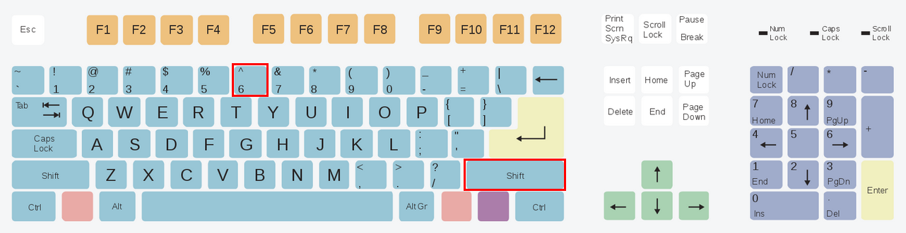
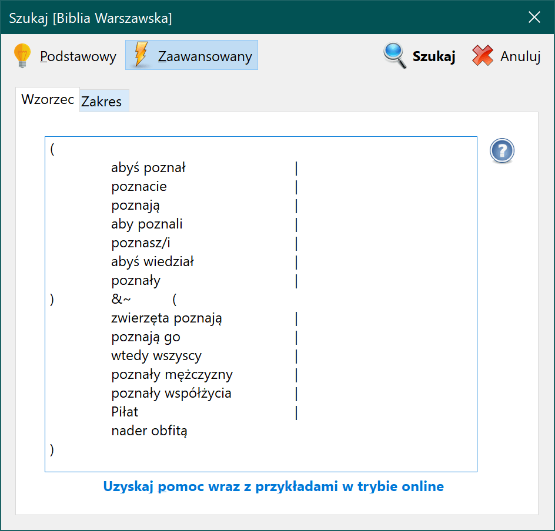

# rBiblia Query Language – Przewodnik

## Wstęp

Tryb wyszukiwania zaawansowanego w rBiblii został zaprojektowany na podstawie funkcjonalności programu **Effata**, który stworzony został przez [Józefa Kajfosza](https://www.docelu.biblia.info.pl) w latach `90. Do celów wyszukiwania został zaprojektowany specjalny język o nazwie **rBQL** (*rBible Query Language* – czyli język zapytań rBiblii). Składa się on z szeregu symboli/znaków które mają specjalne znaczenie oraz z liter wielu alfabetów, które następnie mogą posłużyć do budowania wzorców (wszystkie dozwolone znaki są zawarte na końcu tego zestawienia). Podręcznik ten został podzielony na kilka rozdziałów:

- *Rozdział I* omawia podstawową jednostkę wyszukiwania – atom (pojedyncze słowo) i możliwości jego rozbudowy.
- *Rozdział II* omawia sposoby budowania relacji pomiędzy atomami za pomocą dozwolonych operatorów: `i`, `lub`, `albo`, `nie` oraz nawiasów.
- *Rozdział III* przedstawia sposoby łączenia możliwości wyszukiwania z rozdziału I i II w bardziej skomplikowane wzorce.
- *Rozdział IV* pokazuje funkcje dodatkowe, pomocne podczas przeszukiwania.

Na końcu umieszczony został dodatek, który zawiera dozwolone znaki, przykłady poprawnych i niepoprawnych wzorców oraz umiejscowienie znaków specjalnych na klawiaturze.

### Cel

Celem podręcznika jest wprowadzenie Użytkownika w tematykę wzorców, a dokładniej nauczenie go odczytywania oraz samodzielnego tworzenia zapytań. Poniższy schemat ukazuje budowę wzorca, który będzie omówiony szczegółowo w kolejnych rozdziałach.


### Definicje

Na początek objaśnienie kilku terminów:

- `Słowo` – to pojedynczy ciąg znaków.
- `Fraza` – to słowa oddzielone spacjami, które tworzą spójny ciąg do odnalezienia.
- `Wzorzec` – to zbiór słów/fraz połączonych w relację za pomocą operatorów, opcjonalnie zakończony operatorem kontekstu.
- `Atom` – to podstawowa jednostka wyszukiwania, składa się ze słowa lub frazy oraz dodatkowo może składać się z:

    * przełącznika wielkości liter (np. `słowo/i`)
    * modyfikatora przedrostka (np. `*słowo`)
    * modyfikatora przyrostka (np. `słowo*`)
    * pytajnika zastępującego jeden dowolny znak (np. `s?owo`)

Poszczególne elementy, z których zbudowane są wzorce, będą kolejno omawiane poniżej.

## I. Podstawowe operacje

### 1.1. Wielkość liter

Wyszukiwarka automatycznie wyszukuje słowa, stosując zadaną wielkość liter. Przykładowo, wyszukując w **Biblii Warszawskiej** słowa `bÓg`, otrzymamy 9 wyników.

Opisane zachowanie możemy zmienić za pomocą przełącznika `/i`.

```
bóg/i
```

***Pamiętaj: przełączniki muszą wystąpić tuż za szukanym słowem/frazą. Oznacza to, że między wyrazem a przełącznikiem nie może wystąpić spacja.***

Przełącznik `/i` jest ustawieniem przypisanym do słowa/frazy – oznacza to, że we wzorcu każde słowo/fraza posiada swój zestaw ustawień. Niektóre słowa/frazy będą więc wyszukiwane tak, jak zostały wpisane, a inne (przy użyciu przełącznika) bez względu na wielkość podanych liter.

*i – pochodzi z ang. [i]nsensitive – czyli niewrażliwy (na wielkość liter)*

**Poprawny wzorzec:**

```
bóg/i
```

Wyszukaj wersety, w których występuje dokładnie słowo `bÓg` [trzyliterowe słowo `bÓg`], nie zwracając uwagi na wielkość liter.

Otrzymane wyniki uwzględnią wersety z następującymi wyrazami:

- bóg
- Bóg
- bÓg
- bóG
- BÓg
- bÓG
- BÓG

Dzięki czemu dla **Biblii Warszawskiej** otrzymamy już 1198 wyników.

**Niepoprawny wzorzec:**

```
bóg /i
```

Taki wzorzec jest niepoprawny i zostanie odrzucony przez program, ponieważ przełącznik nie znajduje się zaraz za wyrazem/frazą, ale jest między nimi spacja.

*Obecnie w rBiblii występuje tylko jeden przełącznik, ale w przyszłości może pojawić się ich więcej.*

### 1.2. Przedrostek

*Przedrostek, czyli z łacińskiego `przymocowany na przedzie`.*

Czasami chcemy znaleźć wersety, które zawierają ten sam wyraz, ale w odmienionej formie. Np. chcemy znaleźć słowo `wieczny`, ale także `przed-wieczny`, `od-wieczny`.

W tym celu możemy skorzystać z modyfikatora przedrostków – jego symbolem jest gwiazdka umieszczona tuż przed ciągiem.

**Poprawny wzorzec:**

```
*wieczny
```

Gwiazdka w tym miejscu oznacza: wyszukaj wersety, w których znajdziesz słowa kończące się na `wieczny`, ale pozwól, by to słowo rozpoczynało się dowolnymi innymi znakami.

**Niepoprawny wzorzec:**

```
* wieczny
```

Jest on niepoprawny, ponieważ między modyfikatorem a wyrazem występuje spacja.

* Samo słowo `wieczny` daje 30 wyników w **Biblii Warszawskiej**
* Słowo `*wieczny` daje 31 wyników (1 werset zawiera słowo `odwieczny`)

***Pamiętaj: modyfikator przedrostka uwzględnia również trafienia zawierające sam trzon. To znaczy, że w wynikach wyszukiwania dla wzorca `*wieczny` będą zarówno wersety zawierające dokładnie słowo `wieczny` i takie, które zawierają słowa kończące się na `wieczny`, czyli `odwieczny`, `przedwieczny` itp.***

### 1.3. Przyrostek

*Przyrostek czyli `dołączony` z j. łacińskiego.*

Czasami potrzebne jest wyszukanie wersetów biorące pod uwagę odmiany/końcówki szukanych słów.

Załóżmy, że chcemy wyszukać słowa: `Bogu`, `Boga`, `Bogiem`.

Aby utworzyć działający wzorzec, należy przyjrzeć się odmianom i spróbować znaleźć wspólny trzon (w tym przypadku trzonem będzie `Bog`), a następnie dodać modyfikator przyrostków, czyli gwiazdkę umieszczoną zaraz po wyrazie.

**Poprawny wzorzec:**

```
Bog*
```

Taki wzorzec wyszuka wersety, w których występuje słowo zaczynające się od `Bog` oraz kończące się na dowolnym zestawie znaków, np:

- Bog
- Bogowie
- Bogi
- Bogów
- Bogom
- Bogów
- Bogami
- Bogach itp.

Wszystkie wersety spełniające to kryterium zostaną zaliczone do wyników wyszukiwania.

**Niepoprawny wzorzec:**

```
Bog *
```

Taki wzorzec jest niepoprawny, ponieważ pomiędzy gwiazdką a słowem występuje spacja.

***Pamiętaj: przy użyciu modyfikatora przyrostka także sam trzon jest liczony jako trafienie. W przypadku wzorca `Bog*` werset zawierający samo słowo `Bog` byłby uwzględniony w wynikach wyszukiwania.***

### 1.4. Łączenie modyfikatorów i przełączników

Trzy poprzednie opisy pokazywały dodatkowe opcje, za pomocą których możemy rozszerzyć możliwości wyszukiwania słów/fraz, tj. **przedrostek**, **przyrostek** oraz wyszukiwanie z pominięciem **wielkości liter**.

Teraz dowiesz się, że elementy te można ze sobą łączyć.

```
*wieczn*
```

Taki wzorzec będzie poszukiwał wersetów w których znajdzie:

- odwieczny
- odwieczna
- odwiecznemu
- przedwieczny
- przedwieczna
- przedwiecznemu
- wieczna
- wieczny
- wiecznemu itd.

Innymi słowy – program będzie poszukiwał wersetów, w których znajduje się wyraz składający się z ciągu `wieczn`, czyli ciąg `wieczn` musi znaleźć się gdzieś w wersecie, aby został zaliczony do wyników wyszukiwania.

```
*zmienn*/i
```

Taki wzorzec będzie poszukiwał wersetów w których znajdzie:

- Zmienny
- Odmienny
- odmienny
- przemienny
- przemienna
- Przemienny
- Przemienna
- zmienny
- Zmienna itd.

Innymi słowy – program będzie poszukiwał wersetów, w których znajdzie wyraz składający się z ciągu `zmienn`, nie zważając na wielkość liter. Ciąg `zmienn` musi znaleźć się gdzieś w wersecie, aby został zaliczony do wyników wyszukiwania – nieważne czy pisany dużą, czy małą literą.

### 1.5. Fraza

Frazy są to dwa (lub więcej) słowa oddzielone spacją. Program będzie poszukiwał dokładnie takiego ciągu w Biblii.

```
Jan Chrzciciel
```

Taki wzorzec będzie poszukiwał wersetów, w których słowo `Chrzciciel` występuje zaraz po słowie `Jan` z dokładnie jedną spacją pomiędzy nimi.

**W Biblii Warszawskiej** daje to 6 wyników.

Poszczególne słowa można uzupełniać o przedrostki i przyrostki:

```
Jan* Chrzciciel*
```

Odnajdzie wersety, w których występuje:

- Jan Chrzciciel
- Janowi Chrzcicielowi
- Janem Chrzcicielem itp.

***Pamiętaj: przełącznik wielkości liter (`/i`) ma zastosowanie do całej frazy. Oznacza to, że w przypadku frazy `Jan Chrzciciel` nie można zastosować `Jan/i Chrzciciel`, aby słowo `Jan` było wyszukiwane niezależnie od wielkości liter, a słowo `Chrzciciel` tak, jak zostało podane.***

Modyfikator wielkości liter może wystąpić tylko na końcu frazy:

```
Jan Chrzciciel/i
```

Wyszuka frazę `Jan Chrzciciel`, nie zważając, czy będzie składać się z wielkich czy małych liter, czyli np. `Jan chrzciciel` także zostanie zaliczony.

### Podsumowanie rozdziału I

W pierwszym rozdziale poznaliśmy podstawową jednostkę wyszukiwania, jaką jest *słowo*. Następnie nauczyliśmy się, że *słowo* można uzupełniać o dodatkowe opcje, które mają wpływ na wyniki wyszukiwania. Należą do nich:

- wyszukiwanie niezwracające uwagi na wielkość liter (`słowo/i`),
- przedrostki (`*słowo`),
- przyrostki (`słowo*`),
- frazy (`słowo1 słowo2`),
- kombinacje powyższych (`słowo* *słowo/i`).

Umiejętne stosowanie tych kombinacji przyczyni się do otrzymywania trafniejszych wyników.

## II. Operatory relacji

W tej części przyjrzymy się, w jaki sposób można łączyć ze sobą słowa. Poznamy kilka operatorów, które służą do budowania relacji między atomami. Ich umiejętne użycie może w rezultacie dać ciekawe studium wybranego tematu. Każdy z operatorów posiada specjalny symbol wprowadzany za pomocą klawiatury. Umiejscowienie znaków specjalnych na klawiaturze zostało przedstawione w dodatku na końcu tego przewodnika.

### 2.1. Operator & (`i`)

**Symbol:**

```
&
```

**Opis działania:**

Program wyszuka wersety, w których występują zarówno słowa/frazy z lewej i prawej strony operatora `&`.

**Miejsce na klawiaturze:**

```
Shift + 7
```

**Przykład zastosowania:**

```
Pan&Bóg
```

*(czyt. Pan i Bóg)* – wyszuka wersety, w których występują zarówno słowa `Pan` i `Bóg`.

W **Biblii Warszawskiej** daje to 466 wyników.

**Tablica prawdy:**

| lewa strona | prawa strona | wynik  |
|-------------|--------------|--------|
| PRAWDA      | PRAWDA       | PRAWDA |
| PRAWDA      | FAŁSZ        | FAŁSZ  |
| FAŁSZ       | PRAWDA       | FAŁSZ  |
| FAŁSZ       | FAŁSZ        | FAŁSZ  |

### 2.2. Operator | (`lub`)

**Symbol:**

```
|
```

**Opis działania:**

Program wyszuka wersety, w których występują jedno lub obydwa ze słów/fraz po lewej i prawej operatora `|`.

**Miejsce na klawiaturze:**

```
Shift + \
```

**Przykład zastosowania:**

```
Pan|Bóg
```

*(czyt. Pan lub Bóg)* – wyszuka wersety, w których występuje (a) tylko słowo `Pan` albo `Bóg` lub (b) obydwa słowa `Pan` i `Bóg` naraz.

W **Biblii Warszawskiej** daje to 3959 wyników.

**Tablica prawdy:**

| lewa strona | prawa strona | wynik  |
|-------------|--------------|--------|
| PRAWDA      | PRAWDA       | PRAWDA |
| PRAWDA      | FAŁSZ        | PRAWDA |
| FAŁSZ       | PRAWDA       | PRAWDA |
| FAŁSZ       | FAŁSZ        | FAŁSZ  |

### 2.3. Operator ^ (`albo`)

**Symbol:**

```
^
```

**Opis działania:**

Program wyszuka wersety, w których występuje tylko jedno ze słów/fraz z lewej bądź prawej strony operatora `^`.

**Miejsce na klawiaturze:**

```
Shift + 6
```

**Przykład zastosowania:**

```
Pan^Bóg
```

*(czyt. Pan albo Bóg)* – wyszuka wersety, w których występuje samo słowo `Pan` albo samo słowo `Bóg`, ale odrzuci te wersety w których słowa `Pan` i `Bóg` występują jednocześnie.

W **Biblii Warszawskiej** daje to 3493 wyników.

**Tablica prawdy:**

| lewa strona | prawa strona | wynik  |
|-------------|--------------|--------|
| PRAWDA      | PRAWDA       | FAŁSZ  |
| PRAWDA      | FAŁSZ        | PRAWDA |
| FAŁSZ       | PRAWDA       | PRAWDA |
| FAŁSZ       | FAŁSZ        | FAŁSZ  |

### 2.4. Nawiasy grupujące ()

**Symbol:**

```
( oraz )
```

**Opis działania:**

Za ich pomocą można łączyć słowa/frazy w jedną grupę, aby budować bardziej skomplikowane relacje.

**Miejsce na klawiaturze:**

```
Shift + 9
Shift + 0
```

**Przykład zastosowania:**

```
(Bóg^Jezus)&Duch
```

*(czyt. (Bóg albo Jezus) i Duch)* – wyszukaj wersety, w których `Bóg` jest razem z `Duch` albo `Jezus` jest razem z `Duch`, przy czym `Bóg` i `Jezus` nie mogą wystąpić jednocześnie.

Taka konfiguracja daje 6 znalezionych wyników w **Biblii Warszawskiej**.

**Niepoprawne wzorce nawiasów:**

```
((Bóg^Jezus)&Duch
```

We wzorcu są dwa nawiasy otwierające, ale tylko jeden nawias zamykający.

```
(Bóg^Jezus))&Duch
```

We wzorcu są dwa nawiasy zamykające, ale tylko jeden nawias otwierający.

### 2.5. Operator ~ (`nie`)

**Symbol:**

```
~
```

**Opis działania:**

Program ograniczy wyniki wyszukiwania do wersetów, w których nie występuje zanegowane słowo/fraza.

**Miejsce na klawiaturze:**

```
Shift + `
```

Operator negacji występuje zawsze przed słowem/frazą lub nawiasem otwierającym. Dzięki zastosowaniu tego operatora można wyłączyć ze zbioru wyników wyszukiwań wersety zawierające podane słowo/frazę lub zestaw słów/fraz.

**Przykłady zastosowania:**

```
~Pan&Bóg
```

*(czyt. nie Pan i Bóg)* – wyszuka wszystkie wersety, które zawierają słowo `Bóg` oraz jednocześnie nie zawierają słowa `Pan`.

727 wyników w **Biblii Warszawskiej**.

```
Pan&~Bóg
```

*(czyt. Pan i nie Bóg)* – znajdzie wersety, w których znajduje się `Pan`, ale nie `Bóg`.

2766 wyników dla **Biblii Warszawskiej**.

```
~(Pan&Bóg)
```

*(czyt. nie Pan i Bóg)* – znajdzie wszystkie wersety, w których wyrazy `Pan` i `Bóg` nie występują jednocześnie.

30697 wyników dla **Biblii Warszawskiej**.

**Przykłady niepoprawnych wzorców:**

```
Pan~&Bóg
```

*(Pan nie i Bóg)* – operator negacji nie może występować przed innym operatorem.

```
Pan&Bóg~
```

*(Pan i Bóg nie)* – ponieważ operator negacji nie może występować jako koniec słowa.

***Pamiętaj: choć nie ma to większego sensu, dozwolone jest stosowanie większej liczby negacji. Parzysta liczba negacji da wynik, jakby jej nie było (negacja negacji daje powrót do początku), natomiast nieparzysta liczba negacji da ten sam rezultat, co pojedyncza negacja.***

***Modyfikator przedrostka/przyrostka nie wyklucza trzonu w wynikach wyszukiwań. Na przykład, dla wzorca `*wieczny` trzon to `wieczny`, więc wersety, które zawierają dokładne słowo `wieczny`, będą uwzględnione w wynikach wyszukiwania. Jeśli chcielibyśmy wyszukać wersety zawierające tylko i wyłącznie słowo z jakimkolwiek przedrostkiem, wykluczając wersety, które zawierają sam trzon (np. `wieczny`), możemy użyć wzorca operatora negacji:***

```
*wieczny&~wieczny
```

***Wyszukaj wersety, w których słowo `wieczny` poprzedzone jest jakimś przedrostkiem, ale wyklucz takie wersety, w których występuje tylko słowo `wieczny`.***

**Dzięki temu uwzględnimy wyrazy:**

- przedwieczny
- odwieczny itp.

**A wykluczymy wyraz:**

- wieczny (jako całe jedno słowo)

**Tablica prawdy:**

| prawa strona | wynik  |
|--------------|--------|
| PRAWDA       | FAŁSZ  |
| FAŁSZ        | PRAWDA |

### 2.6. Priorytet operatorów

W przypadku gdy otrzymujemy niepożądane wyniki, warto zastanowić się nad konstrukcją wzorca oraz czy przypadkiem priorytet operatorów nie koliduje z naszymi intencjami.

W poprzednim rozdziale opisano operatory `i`, `albo`, `lub`, `nie` oraz nawiasy. Każdy operator posiada priorytet, aby w przypadku spornych sytuacji, algorytm wiedział w jakiej kolejności należy rozpocząć analizowanie wzorca.

Poniższa lista przedstawia kolejność priorytetów operatorów (od najwyższego), która brana jest pod uwagę przy analizowaniu wzorca:

1. `()` - nawiasy
2. `~` - negacja
3. `&` - i
4. `^` - albo
5. `|` - lub

**Przykład 1**

```
chciwi|chełpliwi^samolubni&pyszni
```

*(czyt. chciwi lub chełpliwi albo samolubni i pyszni)*

Jakich wyników możemy się spodziewać w przypadku powyższego wzorca? Od której pary słów program ma rozpocząć sprawdzanie?

- *chciwi|chełpliwi* ?
- *chełpliwi^samolubni* ?
- *samolubni&pyszni* ?

Odpowiedź uzyskujemy, znając priorytet operatorów.

Najwyższy priorytet w podanym przykładzie posiada operator `&` (czyli `i`). Algorytm w pierwszej kolejności sprawdzi czy w wersecie znajdują się słowa `samolubni` i `pyszni`. Wynikiem operacji będzie `PRAWDA`, jeśli oba słowa znajdują się w wersecie, bądź `FAŁSZ` w każdym innym przypadku.

W kolejnym kroku program będzie posiadał już informację na temat wyniku operacji `&`, która będzie wykorzystana do dalszych działań. Przyjmując, że oba słowa `samolubni` i `pyszni` wystąpiły w aktualnie szukanym wersecie, otrzymamy:

```
chciwi|chełpliwi^PRAWDA
```

Kolejnym operatorem znajdującym się wyżej w hierarchii ważności jest operator `^` (`albo`). W kolejnym kroku do sprawdzenia zostanie wzięta druga para:

```
chełpliwi^PRAWDA
```

Wynikiem operatora `^` będzie `PRAWDA`, gdy jedna albo druga strona jest `PRAWDĄ`, lecz wynikiem będzie `FAŁSZ`, jeśli obie strony będą `PRAWDĄ` albo obie strony będą `FAŁSZEM`.

W tym przypadku wynikiem operatora `^` będzie `FAŁSZ`, jeśli słowo `chełpliwi` znajduje się w wersecie (ponieważ `PRAWDA^PRAWDA` = `FAŁSZ`). W przeciwnym wypadku otrzymalibyśmy `PRAWDĘ` (`FAŁSZ^PRAWDA` = `PRAWDA`).

Zakładając, że sprawdzamy werset w którym nie występuje słowo `chełpliwi`, otrzymaliśmy `PRAWDĘ`.

Uwzględniając poprzednie wyniki, nasz wzorzec będzie wyglądał następująco:

```
chciwi|PRAWDA
```

Operator `|` zwróci `FAŁSZ`, tylko gdy obie ze stron będą `FAŁSZEM`, w przeciwnym wypadku otrzymamy `PRAWDĘ`.

Niezależnie czy werset zawiera słowo `chciwi`, czy nie, werset zostanie zaliczony do wyników wyszukiwania, ponieważ po drugiej stronie otrzymaliśmy już `PRAWDĘ`.

Możemy w tym momencie zauważyć, że jeśli werset posiada słowo `chciwi`, to zostanie zaliczony do wyników wyszukiwania niezależnie od wyniku reszty wzorca, ponieważ nawet gdybyśmy mieli następującą sytuację: `PRAWDA|FAŁSZ`, ostatecznie wynikiem będzie `PRAWDA`.

Podsumowując, wzorzec ***chciwi|chełpliwi^samolubni&pyszni*** będzie wyszukiwał wersetów, w których znajdują się jednocześnie słowa (`samolubni` oraz `pyszni`) albo znajduje się słowo `chełpliwi` (przy czym słowa `chełpliwi`/`samolubni` i `pyszni` nie mogą znaleźć się w jednym wersecie jednocześnie). Do wyników wyszukiwania zaliczony zostanie też każdy werset, który zawiera słowo `chciwi` niezależnie od reszty wzorca.

**Przykład 2**

```
(chciwi|chełpliwi)^samolubni&pyszni
```

Nawiasy zgrupowały pierwsze dwa wyrazy połączone operatorem `|`. Ponieważ nawiasy posiadają najwyższy priorytet, sprawdzenie wzorca w danym wersecie rozpocznie się właśnie od nich.

```
chciwi|chełpliwi
```

To wyrażenie zwróci `FAŁSZ`, gdy żadne ze słów nie znajduje się w wersecie. Jeśli pojawi się jedno lub oba, wtedy otrzymamy `PRAWDĘ`.

Zakładając, że sprawdzamy werset, w którym nie występuje żadne ze słów, otrzymamy `FAŁSZ`.

Analiza wzorca wygląda następująco:

```
FAŁSZ^samolubni&pyszni
```

Pozostały już tylko **dwa** operatory do sprawdzenia. Operator `&` ma pierwszeństwo, więc to on zostanie sprawdzony jako pierwszy.

```
samolubni&pyszni
```

Werset musi posiadać oba słowa, aby wynikiem była `PRAWDA`. Zakładając, że tak się stanie, wynikiem tej operacji będzie `PRAWDA`.

Otrzymaliśmy:

```
FAŁSZ^PRAWDA
```

Ostatnim operatorem jest `^`. W tym miejscu następuje ostateczna decyzja, czy zaliczyć obecny werset do wyników wyszukiwania. Operator `albo` zaliczy werset, jeśli jedna albo druga strona jest `PRAWDĄ`. Tak jest w tym przypadku, a więc werset zostanie zaliczony do wyników wyszukiwania.

Wzorzec ten, choć podobny do wzorca z **przykładu 1**, będzie poszukiwał innych wersetów - czyli takich, w których wystąpi słowo `chciwi` lub `chełpliwi`, przy czym nie wystąpią jednocześnie słowa `samolubni` oraz `pyszni`. Z drugiej strony pokaże wersety, w których występują słowa `samolubni` oraz `pyszni`, ale nie znajdą się tam słowa `chciwi` ani `chełpliwi`.

**Przykład 3**

W tym przykładzie użyty został operator `~` (negacji), a obok siebie znajdują się operatory o takim samym priorytecie.

```
samolubni&~chciwi&pyszni
```

Operator `~` jest usytuowany jako drugi w hierarchii priorytetów, więc w podanym przykładzie zostanie on sprawdzony jako pierwszy. Jest to operator jednoargumentowy, tzn. interesuje go tylko słowo/fraza/wynik z nawiasu bezpośrednio do niego przylegającego.

```
~chciwi
```

Werset zostanie sprawdzony pod kątem wystąpienia słowa `chciwi`. Jeżeli słowo zostanie odnalezione, wynikiem operacji będzie `PRAWDA`. Operator `~` zamieni `PRAWDĘ` w `FAŁSZ` (i analogicznie `FAŁSZ` w `PRAWDĘ`). Zakładając, że słowo `chciwi` nie występuje w szukanym wersecie, zanegowany `FAŁSZ` da w rezultacie `PRAWDĘ` i ostatecznie otrzymamy:

```
samolubni&PRAWDA&pyszni
```

Dwa operatory `&` (o tym samym priorytecie) zostaną sprawdzane w takiej kolejności, w jakiej występują we wzorcu:

```
samolubni&PRAWDA
```

Zakładając, że przeszukiwany werset zawiera słowo `samolubni`, otrzymamy: `PRAWDA&PRAWDA` - co w wyniku da `PRAWDĘ`:

```
PRAWDA&pyszni
```

To czy słowo `pyszni` znajduje się w wersecie, czy nie, będzie miało decydujące znaczenie dla znalezienia się tego wersetu w wynikach wyszukiwania, ponieważ dla operatora `&` tylko `PRAWDA&PRAWDA` może dać w wyniku `PRAWDĘ`.

Wzorzec ten poszukuje wersetów, w których znajdują się słowa `samolubni` oraz `pyszni`, ale nie znajduje się słowo `chciwi`.

### Podsumowanie rozdziału II

Ten rozdział przedstawiał metody łączenia ze sobą słów/fraz za pomocą 5 operatorów: `i`, `lub`, `albo`, nawiasów i `negacji`. Pokazane zostały ich przykładowe zastosowania. Zrozumienie zagadnień z tego rozdziału jest kluczowe do tworzenia bardziej skomplikowanych wzorców. Aby w pełni zrozumieć i móc przewidzieć wynik utworzonego wzorca, przydatna jest wiedza z zakresu działania operatorów logicznych `NOT`, `AND`, `OR` oraz `XOR`.

## III. Łączenie modyfikatorów i przełączników wraz z operatorami

Ten rozdział jest dużo bardziej zaawansowany. Wymaga zrozumienia dwóch poprzednich rozdziałów. Od teraz można przejść do bardziej praktycznych zastosowań. Skupimy się tutaj na kilku przykładach wraz z ich opisem.

### Przykład 1

```
syn* człow*/i&przyjd*/i
```

Ten wzorzec będzie poszukiwał wersetów, które zawierają frazę `syn człow` z różnymi końcówkami, np. `syna człowieczego` itp. (nie zważając na wielkość liter) oraz posiadają słowo zaczynające się na `przyjd` i kończące się na dowolnym ciągu znaków (też pomijając wielkość liter). Dzięki temu powinniśmy otrzymać wersety, w których mowa jest o przyjściu `Syna Człowieczego`.

W **Biblii Warszawskiej** daje to 13 wersetów, lecz nie wszystkie dotyczą tego tematu.

### Przykład 2

```
Duch* Jezus*|Duch* Chryst*|Duch* Syn*/i
```

Ten wzorzec poszukuje w tekstach biblijnych trzech fraz z ich odmianami: `Duch Jezusa`, `Duch Chrystusa` lub `Duch Syna`. Dzięki temu możemy otrzymać wersety w których `Duch Boży`, `Duch Święty` nazwany jest `Duchem Jezusa`.

Otrzymamy 6 takich wersetów.

### Przykład 3

```
(dzień/i|dniu/i)&(pań*/i|chryst*/i)
```

Za pomocą tego wzorca możemy starać się odnaleźć wersety, które mówią o `przyjściu pańskim/Chrystusa`. Pierwszy nawias określa, że werset musi zawierać słowo `dzień` lub słowo `dniu` z pominięciem wielkości znaków. Drugi nawias określa, że werset musi posiadać wyraz rozpoczynający się na `pań` i kończący dowolnym ciągiem (np. `pański` itp.) lub słowo rozpoczynające się na `chryst`, a kończące się dowolnym ciągiem z pominięciem wielkości znaków. Relacja pomiędzy nawiasami to `i`, więc minimalnie w wersecie musi wystąpić po jednym wyrazie z obu nawiasów.

Odnajduje to 17 wersetów, lecz nie wszystkie pasują do tematu.

### Przykład 4

```
(abyś poznał|poznacie|poznają|aby poznali|poznasz/i|abyś wiedział|poznały|abyście poznali)
&~(zwierzęta poznają|poznają go|wtedy wszyscy|poznały mężczyzny|poznały współżycia|Piłat|nader obfitą)
```

Ten wzorzec może wydawać się skomplikowany. W rzeczywistości pierwszy nawias określa pewien zbiór słów które mają się pojawić w wersecie, drugi nawias wyklucza z tego zbioru pewne frazy/słowa, które nie pasują do tematu, a występowały w wynikach wyszukiwania. Wzorzec ten służy do odnalezienia fragmentów w których Bóg poprzez swoje działanie chce nas czegoś nauczyć, chce abyśmy wyciągnęli jakiś wniosek z jakiejś sytuacji, abyśmy coś o Nim poznali lub coś zrozumieli.

**Biblia Warszawska** daje tutaj 140 wyników, ale nie wszystkie są trafne.

## IV. Funkcje dodatkowe

### 4.1. Znak zapytania

Jest to opcja, która wzbogaca atomy. Umieszczenie w którymś miejscu słowa/frazy pytajnika da możliwość zastosowania tzw. `dzikiej karty`. W tym miejscu słowa może pojawić się dowolny jeden znak.

**Przykład zastosowania:**

```
Je?us
```

Taki wzorzec będzie poszukiwał wersetów w których znajduje się pięcioliterowe słowo rozpoczynające się od `Je`, kończące na `us`, a pomiędzy nimi znajdzie się jeden dowolny znak.

Wynikiem może być np. `Jezus`, `Jesus` itp.

***Ciekawostka: stosując same znaki zapytania np. `????`, otrzymamy wersety w których występują 4 literowe słowa. W ten sposób możemy spróbować odnaleźć najdłuższe słowo w wybranym tłumaczeniu.***

### 4.2. Kontekst

Kontekst znajduje się na końcu wzorca. Reprezentowany jest za pomocą znaku małpy oraz następującej po nim liczby z przedziału 1-9.

```
@2
```

Podając liczbę w kontekście (1-9), można ustalić w jaki sposób program będzie przeszukiwał Biblię. Domyślnie program sprawdza werset po wersecie, sprawdzając, czy spełniony jest wpisany przez użytkownika wzorzec.

W przypadku kontekstu `@2`, program złączy werset 1 z 2 i na takim połączeniu dwóch wersetów sprawdzi, czy wzorzec jest spełniony. Następnie złączy werset 2 i 3 oraz sprawdzi czy wzorzec występuje w tym układzie, następnie sklei werset 3 i 4 itd.

W przypadku kontekstu `@3` przeszukiwane są sklejone wersety 1, 2 i 3, następnie 2, 3 i 4 itd.

Jeśli wzorzec zostanie spełniony w kontekście 1-3, te trzy wersety zostają dodane do wyników wyszukiwania, a kolejne przeszukiwanie rozpoczyna się od pierwszego kontekstu występującego po ostatnim wyniku (aby nie powielać wyników wyszukiwania), czyli w tym wypadku 4-6.

Dzięki kontekstowi możemy poszerzyć obszar poszukiwań konkretnego wzorca w interesującym nas przekładzie, aby być może otrzymać ciekawsze wyniki.

Dla przykładu, jeśli szukany przez nas wzorzec nie trafi się przy przeszukiwaniu pojedynczych wersetów, może okazać się, że występuje on w szerszym kontekście – ta opcja istnieje, aby to sprawdzić.

**Przykład zastosowania:**

```
Boga&powstało
```

Daje werset, w którym występuje `Boga` i `powstało` jednocześnie. W **Biblii Warszawskiej** daje to 1 werset. Poszerzając kontekst do dwóch wersetów, otrzymamy 4 wersety:

```
Boga&powstało@2
```

### Podsumowanie

To już koniec. Mamy nadzieję, że tematyka zaawansowanego wyszukiwania została przedstawiona w miarę prostym językiem. Instruktaż ten z pewnością będzie jeszcze aktualizowany w przyszłości, a uwagi są mile widziane.

Próg wejścia dla osób nietechnicznych nie jest wcale taki niski. Trzeba opanować parę terminów i koncepcji, ale kiedy to będzie za nami, zaawansowany tryb wyszukiwania może przynieść wiele korzyści, a tworzenie nowych wzorców będzie czymś naturalnym.

Stopień skomplikowania wzorców nie został dotychczas ograniczony programowo. Można dowolnie je łączyć, jeżeli tylko sprzęt, na którym działa aplikacja, jest w stanie stawić czoła poszukiwaniom.

Na zakończenie prosimy, aby nie zatrzymywać *perełek* dla siebie. Zachęcamy do [podsyłania ciekawszych wzorców](https://kontakt.toborek.info), abyśmy mogli utworzyć swego rodzaju bazę, z której korzystać będą mogli wszyscy.

Owocnego przeszukiwania Biblii!

## V. Dodatek

### 5.1. Dozwolone znaki w wyrazach

- litery angielskiego alfabetu (duże i małe) a-z
- polskie litery diakrytyczne (`ąęśćż` itp.)
- znak apostrofu ` – potrzebny dla angielskich tłumaczeń np. `Christ`s`
- znaki cyrylicy
- greckie litery alfabetu
- rumuńskie litery alfabetu
- `?`
- spacja
- `*`
- `/i`

### 5.2. Więcej przykładów

**Poprawne wzorce:**

```
Bóg|Ojciec
```

Wyszukaj wersety, w których występuje słowo `Bóg` lub `Ojciec` lub oba naraz.

```
Bóg&(Ojciec|Król/i)
```

Wyszukaj wersety, w których występuje słowo `Bóg` wraz ze słowem `Ojciec`

lub gdzie występuje słowo `Bóg` wraz ze słowem `Król`, przy czym słowo `Król` wyszukuj, nie zważając na wielkość liter

lub gdzie występuje słowo `Bóg` wraz ze słowem `Ojciec` i słowem `Król`, przy czym słowo `Król` wyszukuj, nie zważając na wielkość liter.

```
syn* człow*/i
```

Wyszukaj wersety, w których występuje np. fraza `syn człowieczy` w różnej formie, tzn. `syn człowieczy`, `synowi człowieczemu`, `synem człowieczym` itd.

**Niepoprawne wzorce:**

```
Chrystus */i
```

Wzorzec ten jest niepoprawny, ponieważ gwiazdka przyrostka nie przylega do wyrazu, lecz znajduje się między nimi spacja. Poprawna forma to `Chrystus*/i`.

```
* wieczny
```

Wzorzec jest niepoprawny, ponieważ gwiazdka przedrostka nie przylega do wyrazu, pomiędzy nimi znajduje się spacja. Poprawna forma to `*wieczny`.

```
(dni*|dzień)&&ostatecz*
```

Powodem błędu jest wystąpienie dwukrotnie znaku `&` (`i`) – operatory relacji (`&`, `|`, `^`) mogą występować tylko raz między wyrazami.

```
przymierze&(Pan|Bóg))
```

Liczba nawiasów otwierających i zamykających nie jest równa, brakuje tutaj nawiasu otwierającego.

### 5.3. Rzadziej używane znaki na klawiaturze

- `~` – *(tylda)* znak negacji



- `&` – i


- `|` – lub


- `^` – albo



### 5.4. Stylowanie wzorców

Im większy stopień skomplikowania wzorca, tym trudniej zachować jego czytelność. Podczas interpretowania wzorca pomijane są białe znaki takie jak:

- tabulator
- znak nowej linii

Dzięki temu można poprawić czytelność zapisu, zachowując jednocześnie jego funkcjonalność.



## Autorzy

- [Kacper Kość](https://github.com/jaspre) (implementacja rBQL, autor przewodnika)
- [Rafał Toborek](https://github.com/clash82) (twórca rBiblii, korekty w przewodniku)
- [Józef Kajfosz](https://www.docelu.biblia.info.pl) (pomysłodawca i twórca programu *Effata*)
- [Jakub Wardęga](https://www.proz.com/profile/2037613) (korekta tekstu, sugestie i testy rBiblii)

Strona domowa programu: [rbiblia.toborek.info](https://rbiblia.toborek.info)

Przewodnik opublikowany jest bezpłatnie w [trybie online](https://rbiblia.github.io/rbql/).
Wszelkie poprawki i propozycje w tym przewodniku będą bardzo mile widziane. Propozycje zmian oraz sugestie prosimy zgłaszać za pomocą opcji `Pull Request` lub poprzez utworzenie nowego `Issue` w [repozytorium na GitHubie](https://github.com/rBiblia/rbql).

Praca nad programem, tłumaczeniami oraz dokumentacją pochłania środki materialne. Jeżeli możesz, prosimy o [dobrowolne wsparcie projektu](https://rbiblia.toborek.info/donation/).

> Całe Pismo przez Boga jest natchnione i pożyteczne do nauki, do wykrywania błędów, do poprawy, do wychowywania w sprawiedliwości, aby człowiek Boży był doskonały, do wszelkiego dobrego dzieła przygotowany. [2Tym 3:16-17]

&copy; 2020 Soli Deo gloria
